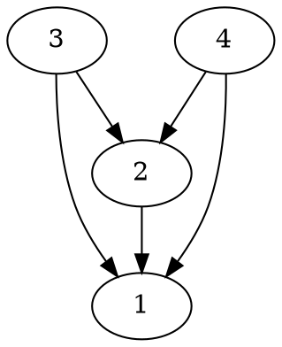
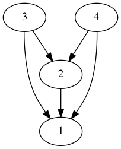
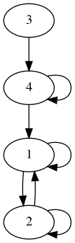

## Ejemplo para sdescribir relaciones.

Supongamos que nos interesa graficar la siguiente relacion U={(2,1),(3,1),(3,2),(4,1),(4,2),(4,3)} de A sobre un conjunto A = {1,2,3,4} 
como se muestra en el siguiente codigo.



El resultado que obtenemos es el siguiente.




Ahora suppongamos que nos interesa mostrar las relaciones que son reflexivas como es el par ordena (1,1)∈R
como en la siguiente relacion R={(1,1),(1,2),(2,1),(2,2),(3,4),(4,1),(4,4)}

El codigo es el siguiente:

```
digraph D{

/*
Se esta utilizando la relacion
R={(1,1),(1,2),(2,1),(2,2),(3,4),(4,1),(4,4)}
*/
1 -> 1 ;
1 -> 2 ;
2 -> 1
2 -> 2 ;
3 -> 4 ;
4 -> 1 ;
4 -> 4 ;

}
```

El resultado es el siguiente.



Creative Commons 2021


Dr. Eduardo Eloy Loza Pacheco 


[Pagina personal](https://lenguajesformales.org/)