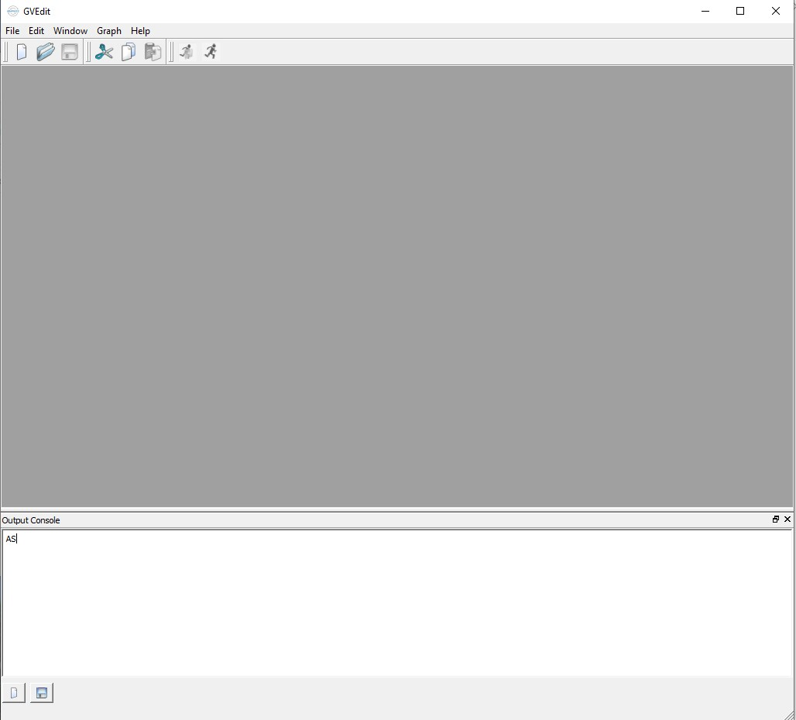
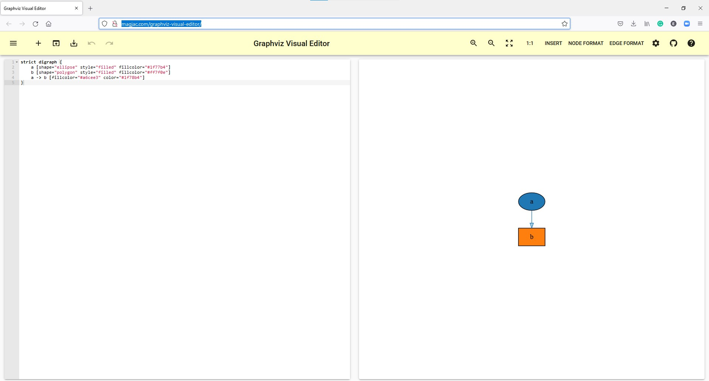

# Graphviz

Graphviz es una Herramienta de construcción de graficas. Cuyas aplicaciones están en construir:

- Grafos no dirigidos
- Grafos dirigidos
- Listas
- Diagramas de Hasse
- Relaciones entre objetos
- Jerarquías 
- Listas
- Etc.

## Descarga e Instalación.

[Puedes descargarlo de la siguiente dirección](https://graphviz.org/download/)

[Su documentación se encuentra  aquí ](https://graphviz.org/documentation/)

### Sobre la versión 2.38

Actualmente solo esta disponible la versión numero 2.38 solo para modo grafico para Windows debido a que se usa una aplicación denominada GVEDIT. Sin embargo según el sitio [click aqui](https://forum.graphviz.org/t/is-gvedit-depreciated/349/2) , se esta trabajando en una versión de Graphviz para Windows.

Cada día salen versiones estables que se pueden utilizar ejecutando el cmd en Windows.

###  Versión en línea del editor

También existe una versión en linea de este editor [Editor en linea](http://magjac.com/graphviz-visual-editor/)

