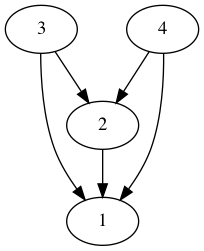

# Graphviz

Graphviz es una Herramienta de construcción de graficas. Cuyas aplicaciones están en construir:

- Grafos no dirigidos
- Grafos dirigidos
- Listas
- Diagramas de Hasse
- Relaciones entre objetos
- Jerarquías 
- Listas
- Etc.


## Descarga e Instalación.

[Puedes descargarlo de la siguiente dirección](https://graphviz.org/download/)

[Su documentación se encuentra  aquí ](https://graphviz.org/documentation/)


### Sobre la versión 2.38

Actualmente solo esta disponible la versión numero 2.38 solo para modo grafico para Windows debido a que se usa una aplicación denominada GVEDIT. Sin embargo según el sitio [click aqui](https://forum.graphviz.org/t/is-gvedit-depreciated/349/2) , se esta trabajando en una versión de Graphviz para Windows.


Cada día salen versiones estables que se pueden utilizar ejecutando el cmd en Windows.


###  Versión en línea del editor


También existe una versión en linea de este editor [Editor en linea](http://magjac.com/graphviz-visual-editor/)


## Ejemplo de graphviz

Supongamos que nos interesa graficar la siguiente relacion U={(2,1),(3,1),(3,2),(4,1),(4,2),(4,3)} de A sobre un conjunto A = {1,2,3,4} 
como se muestra en el siguiente codigo.


El resultado que obtenemos es el siguiente.




Ahora suppongamos que nos interesa mostrar las relaciones que son reflexivas como es el par ordena (1,1)∈R
como en la siguiente relacion R={(1,1),(1,2),(2,1),(2,2),(3,4),(4,1),(4,4)}

El codigo es el siguiente:

```
digraph D{

/*
Se esta utilizando la relacion
R={(1,1),(1,2),(2,1),(2,2),(3,4),(4,1),(4,4)}
*/
1 -> 1 ;
1 -> 2 ;
2 -> 1
2 -> 2 ;
3 -> 4 ;
4 -> 1 ;
4 -> 4 ;

}
```

El resultado es el siguiente.


Creative Commons 2012


Dr. Eduardo Eloy Loza Pacheco 


https://lenguajesformales.org/
